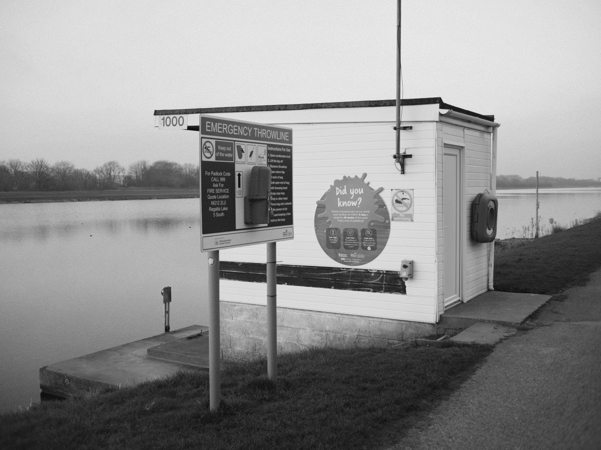
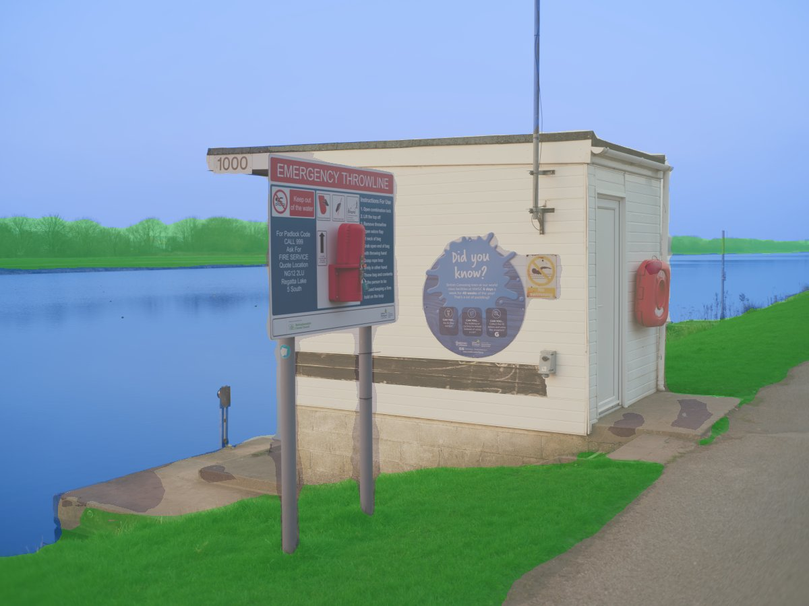

# Semantic Grain

**Context-aware film grain that understands your photograph.**

<p align="center">
  
</p>

Semantic Grain uses AI semantic segmentation to identify regions in your photograph -- sky, water, skin, vegetation, concrete -- and applies unique FFT-spectral grain to each, modeling how real photographic emulsion responds differently across a scene. Shadows accumulate heavier grain. Highlights stay clean. Every region gets its own spectral character.

This is not a filter. It is a computational emulsion.

---

## Before | After | How It Sees

<table>
  <tr>
    <td align="center"><strong>Original</strong></td>
    <td align="center"><strong>Semantic Grain</strong></td>
    <td align="center"><strong>Segmentation Map</strong></td>
  </tr>
  <tr>
    <td></td>
    <td></td>
    <td></td>
  </tr>
</table>

The segmentation map shows how the model understands the scene. Each colored region receives grain with distinct spectral characteristics -- different size, clumpiness, shadow response, and highlight rolloff.

| Color | Region | Grain character |
|-------|--------|-----------------|
| Peach | Skin | Fine, gentle, restrained in highlights |
| Blue | Sky | Very fine, smooth, minimal shadow boost |
| Green | Vegetation | Medium, moderate clumping |
| Dark blue | Water | Fine, smooth, strong spectral slope |
| Tan | Concrete | Coarse, pronounced, gritty |
| Grey | Default | Medium, balanced |

---

## Features

- **Film stock grain presets** -- built-in grain structures inspired by Tri-X, HP5, T-Max, Portra, Acros, Delta 3200, FP4, and Double-X
- **Selectable segmentation backends** -- choose between multiple SegFormer variants and optional Mask2Former for higher-quality scene understanding
- **Cross-platform device support** -- Windows/Linux CUDA and macOS MPS/CPU support with a UI toggle for GPU usage
- **Cached interactive rendering** -- tiered caching avoids recomputing unchanged stages for much faster preview updates
- **Semantic segmentation** -- 150 ADE20K classes mapped to 6 grain categories
- **Multi-octave FFT grain synthesis** -- frequency-domain grain shaped across multiple scales for more film-like clumping
- **Luminance-aware modulation** -- heavier grain in shadows, lighter in highlights, matching real silver halide behavior
- **Per-region grain profiles** with 6 parameters each: center frequency, bandwidth, spectral slope, amplitude, shadow boost, highlight rolloff
- **Soft mask blending** -- Gaussian-softened region boundaries prevent visible seams
- **HSV skin detection** -- refines person segmentation to distinguish skin from clothing
- **Film tone curve** -- parametric S-curve with independent toe and shoulder control
- **Channel-weighted B&W conversion** -- customizable RGB mix (default: 35/45/20)
- **Interactive Gradio UI** with real-time parameter adjustment
- **YAML grain presets** -- ships with Ilford Delta 400-inspired defaults
- **16-bit TIFF export** for maximum tonal fidelity

---

## How It Works

```text
Input Image
    |
    v
[Segmentation Backend] ---> 150-class Label Map ---> 6 Grain Category Masks
    |                                                      |
    v                                                      v
[B&W Conversion]                                [Gaussian Soft Blending]
    |                                                      |
    v                                                      v
[Luminance Map] ----------> [Per-Region Multi-Octave Grain Synthesis]
    |                                  |
    v                                  v
[Zone Masks] -----> [Luminance-Modulated Grain Compositing]
                                       |
                                       v
                              [Parametric Tone Curve]
                                       |
                                       v
                                    Output
```

Each grain category has its own spectral profile controlling grain size, clumpiness, and tonal response. Grain is synthesized in the frequency domain using shaped bandpass filters, then modulated by local luminance so shadows naturally accumulate more grain -- just like real film.

---

## Installation

### Prerequisites

- Python 3.11+
- CPU is supported on all platforms
- CUDA-capable GPU is recommended on Windows/Linux for faster segmentation and grain synthesis
- Apple Silicon Macs can use MPS-compatible PyTorch, though GPU use is off by default in the UI

### Setup with Conda (recommended)

```bash
git clone https://github.com/samwild1/semantic-grain.git
cd semantic-grain
conda env create -f environment.yml
conda activate sgrain
pip install -e .
```

### Setup with pip

```bash
git clone https://github.com/samwild1/semantic-grain.git
cd semantic-grain
pip install -e .
```

> **GPU users:** `pip install torch` defaults to CPU-only on most platforms. For CUDA support, install PyTorch first from the [official index](https://pytorch.org/get-started/locally/), e.g.:
> ```bash
> pip install torch torchvision --index-url https://download.pytorch.org/whl/cu124
> pip install -e .
> ```

> **Optional Mask2Former backend:** install the extra dependency with `pip install -e .[mask2former]` or add `timm` to your environment.

> On first run, model weights are downloaded automatically from Hugging Face.

---

## Usage

### Launch the interactive UI

```bash
python -m semantic_grain
```

This opens a Gradio web interface where you can:
- Upload any photograph
- Choose the segmentation model
- Toggle GPU usage when supported on your machine
- Pick a film stock grain preset or fine-tune region profiles manually
- Adjust global grain strength, tone curve, and B&W channel mix
- Fine-tune per-region grain parameters (6 parameters x 6 regions)
- Visualize the segmentation mask
- Export as JPEG or 16-bit TIFF

### Windows quick launch

Double-click `Start Semantic Grain.bat` (assumes Conda is installed).

### Programmatic use

```python
from semantic_grain.io.loader import load_image
from semantic_grain.pipeline import run_segmentation, apply_grain

image = load_image("your_photo.jpg")
masks = run_segmentation(image, method_key="segformer_b5")
result = apply_grain(image, masks, convert_bw=True, preview_size=None)
```

---

## Grain Presets

The app includes built-in film stock grain presets in addition to the YAML preset support in `presets/`. These presets set different per-region structures for classic cubic-grain and tabular-grain looks while keeping the global strength control consistent.

Available presets include Kodak Tri-X 400, Ilford HP5 Plus 400, Kodak T-Max 100, Ilford Delta 3200, Fuji Neopan Acros 100 II, Kodak Portra 400, Ilford FP4 Plus 125, and Kodak Double-X 5222.

| Parameter | What it controls |
|-----------|-----------------|
| `center_freq` | Grain size (higher = finer) |
| `bandwidth` | Variation in grain clump sizes |
| `spectral_slope` | Organic feel (higher = more natural 1/f clumping) |
| `amplitude` | Overall grain intensity for this region |
| `shadow_boost` | Extra grain in dark areas (>1 = heavier shadows) |
| `highlight_rolloff` | Grain reduction in bright areas (<1 = cleaner highlights) |

---

## Project Structure

```text
semantic-grain/
|-- semantic_grain/
|   |-- app.py                # Gradio web interface
|   |-- pipeline.py           # Core processing orchestration
|   |-- config.py             # Profiles, mappings, defaults
|   |-- device.py             # Cross-platform CPU/GPU selection
|   |-- cache.py              # Cached interactive processing state
|   |-- segmentation/         # Backend registry + segmentation models
|   |-- grain/                # FFT spectral synthesis
|   |-- luminance/            # Tone curves + zone system
|   |-- blending/             # Soft mask compositing
|   |-- color/                # B&W conversion
|   `-- io/                   # Image loading + saving
|-- presets/                  # YAML grain presets
|-- examples/                 # Figure and example images
|-- scripts/                  # Utility scripts
|-- environment.yml           # Conda environment
`-- pyproject.toml            # Package metadata
```

---

## License

This project is licensed under [CC BY-NC-ND 4.0](https://creativecommons.org/licenses/by-nc-nd/4.0/).

You may use this software for personal, non-commercial purposes. Commercial use and derivative works are not permitted.

---

## Acknowledgments

- [NVIDIA SegFormer](https://huggingface.co/nvidia/segformer-b5-finetuned-ade-640-640) for semantic segmentation
- Grain synthesis is inspired by how real silver halide crystals respond to light, not by any existing digital filter

---

*Semantic Grain is the first module of a larger vision: building a native digital medium with the emotional intelligence of film.*
